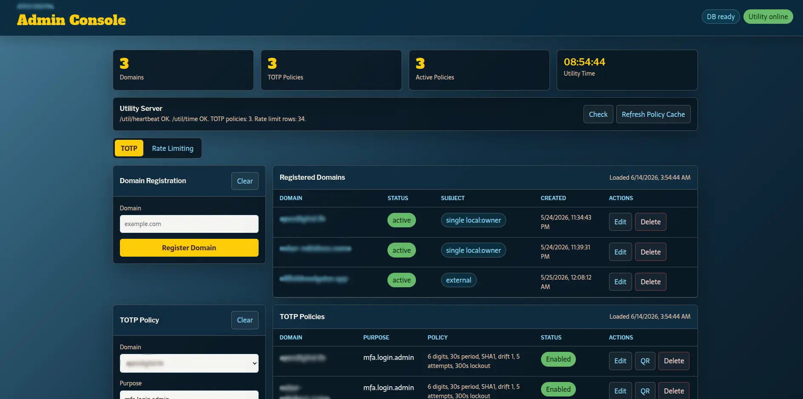

A GitHub-native portfolio of public projects and selected private work.

## Featured Projects

This section is for larger, flagship, or especially representative work.

## Recent Work

<table>
<tr>
<td width="38%">

</td>
<td>

### Utility Server

Public repo. A small FastAPI utility service I built for common cross-domain backend tasks: TOTP authentication, domain and policy management, token issuance, and database-backed rate limiting.

The project includes a lightweight PHP admin console for managing domains, TOTP policies, and rate-limit rules, with connectivity checks intended for web and mobile clients.

**Links:** [GitHub repo](https://github.com/robione-nr/utility-server)

</td>
</tr>
</table>

## Project Index

| Project | Visibility | Summary | Links |
| --- | --- | --- | --- |
| Utility Server |  | FastAPI service and admin UI for TOTP, tokens, domains, and rate limiting. | [Repo](https://github.com/robione-nr/utility-server) |
