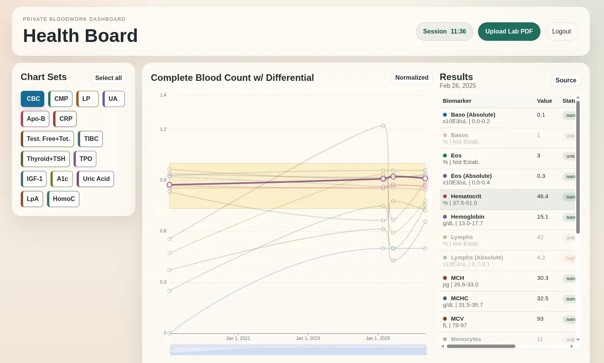

# Biometrics Dashboard

A private, single-user dashboard that uses python extraction with AI-assisted parsing to turn lab PDFs into structured biometric trend data. The project is built around a reviewable workflow: upload a PDF, extract text/tables with OCR fallback, have an LLM convert the evidence into lab rows, inspect the extraction, import confirmed results, and compare biomarkers over time.

When the doctor asks, "How are things looking?" I can give him the URL and a 6-digit code.

## Screenshots

<table>
<tr>
<td width="50%">

</td>
<td width="50%">

</td>
</tr>
</table>

## What It Does

- Authenticates a private dashboard with TOTP-backed session flow.
- Accepts lab PDF uploads and checks for duplicate source documents.
- Runs a Python parser pipeline that extracts PDF text and tables, falls back to OCR for sparse pages, and sends extracted text through a configured LLM provider.
- Presents parsed results for review before import.
- Stores confirmed reports and lab rows in MySQL.
- Streams the original source PDF only to authenticated sessions.

## Architecture

The public endpoint is plain PHP, JavaScript, and CSS under `html/`. Private parser and database scripts live under `scripts/`, with Apache denied access to that folder. The database schema is kept in `scripts/health_db.sql`; local user/grant SQL and upload workspaces are ignored.

The parser currently has three versions, with `v3` as the active path. It uses `pdfplumber`, `pypdfium2`, `pytesseract`, and Pillow, then routes extracted text through either OpenRouter or Ollama based on runtime configuration.

## Dashboard Behavior

The charting layer is intentionally practical rather than decorative. Each selected biomarker group owns its own chart, request state, result table, display mode, and zoom state, so groups can be toggled on and off without resetting the whole dashboard.

- Raw and normalized views can be switched per chart.
- Normalized mode compares values against available reference bounds.
- Reference ranges are overlaid as bands when a single biomarker is visible or when a hovered point provides a focused range.
- Hovering a chart point highlights the related table row, updates the active report/date for that chart, and adjusts the Source button to open the matching PDF.
- Hovering a table row focuses the corresponding chart series.
- Clicking table rows toggles individual biomarkers on or off inside a chart.
- Data zoom is preserved when chart mode, focus, or series visibility changes.
- Tooltips show date, test name, value, unit, reference range, and status.
- The Source action opens the authenticated original PDF endpoint for the active report.

## Why It Matters

This project is a practical example of building around messy real-world input. The hard part is not only charting values; it is validating uploads, preserving source provenance, handling parser uncertainty, protecting private health data, and making the import step reviewable instead of blindly trusting automation.

## Status

MVP. The core private workflow works end to end, with room to improve parser tests, migration strategy, and fully database-driven chart definitions.

Potential future directions include supplement and/or diet tracking, Fitbit and other wearable ingestion, and imaging data.
